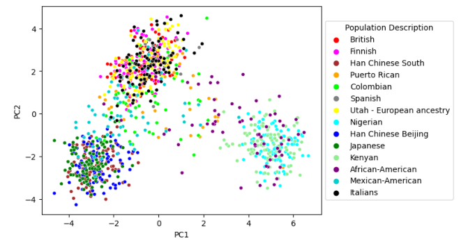

# PCA_genetic_analysis

Here we are trying to link the single nucleotide polymorphism (SNP) profile of chromosome 21 from patients to their geographic locations using PCA analysis. We get our data from the The International Genome Sample Resource which has sequenced the genomes a patients from all over the world and has the SNP variations for these patients recorded. We selected 1000 SNP locations at random from chromosome 21 and performed PCA analysis to see if we can find meaningful clusters in the PCA plot relating to the location of the patient.

The way the data is structured is that each patient will have an entry for each SNP of either 0 or 1 depending on whether the base at the position of each SNP consistent with the reference genome (0) or if they have alternative base (1). Each entry will have two elements as each person has two copies of chromosome 21 (one from their mother and one from their father). This will mea there are 4 possible combinations for the entry for each patiet at each SNP location:

['0', '0'] : The patient has the reference nucleotide on both maternal and paternal chromosome

['1', '0'] : The patient has the reference nucleotide on one chromosome and the the alternative nucleotide on the other

['0', '1'] : The patient has the reference nucleotide on one chromosome and the the alternative nucleotide on the other

['1', '1'] : The patient has the alternative nucleotide on both maternal and paternal chromosome

This information was used for encoding the data for fitting the principle components axes:

['0', '0'] = 0
['1', '0'] = 1
['0', '1'] = 1
['1', '1'] = 2

PC1 and PC2 were then calculated and the original data points were transformed to obtain the values of these two principal components for each data point. The country and continent information for each patient was then added to the dataframe.

The data points were then plotted on the principle component axes and each point coloured by the country of origin for each patient (see below). This was not very informative however it does appear as if there are 3 clusters of points.

The data was replotted with the data coloured by continent and we get a clearer picture of what is going on in our data (se below). Three distinct clusters can be seen corresponding to patients from Africa, Europe and Asia. There is another more diffuse cluster of points which relates to patients from America. This analysis shows that we can cluster patients by their geographic location based on PCA analysis of their SNP profiles

